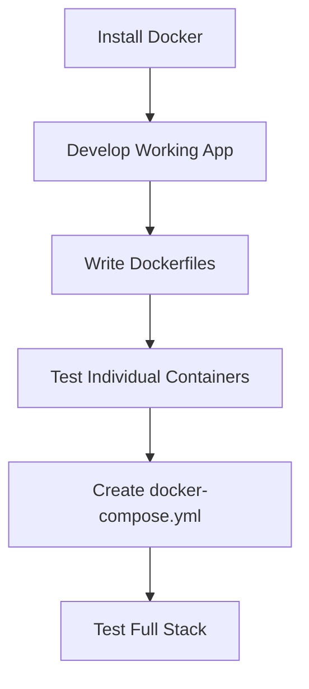

Here's the **correct order** you should follow, explained clearly:

### Step-by-Step Roadmap

1. **First Install Docker** (on your local machine)
   - Follow the installation steps for your OS (Windows/Mac/Linux)
   - Verify with `docker --version` and `docker-compose --version`

2. **Learn Basic Docker Commands** (before writing Dockerfiles)
   - Try these test commands:
     ```bash
     docker run hello-world
     docker ps -a
     docker images
     ```

3. **Develop Your Application Locally** (without Docker)
   - Set up your:
     - Frontend (React/Vite/etc.)
     - Backend (Node.js/Express/etc.)
   - Make sure it works normally outside containers

4. **Write Dockerfiles** (after app works locally)
   - Start with simple Dockerfiles (like the ones you shared)
   - Test building images:
     ```bash
     docker build -t frontend ./frontend
     docker build -t backend ./backend
     ```

5. **Create docker-compose.yml** (last step)
   - Combine both services
   - Add volumes, networks, and environment variables

### Why This Order Works Best

1. **Docker First**:
   - You need Docker installed to test any containers
   - Understanding Docker basics helps debug issues

2. **Working App Before Containerization**:
   - Fix all application issues first
   - Containerization won't solve broken code

3. **Incremental Complexity**:
   - First make individual containers work
   - Then make them work together via compose

### Common Mistakes to Avoid

❌ Trying to write Dockerfiles before Docker is installed  
❌ Containerizing a broken/non-working application  
❌ Writing complex docker-compose files before testing individual containers  

### Example Workflow



### When You're Ready to Start

Begin with this simple test:
```bash
# After Docker installation
docker run -d -p 80:80 docker/getting-started
```
Then visit `http://localhost` to verify Docker works before proceeding with your project containers.